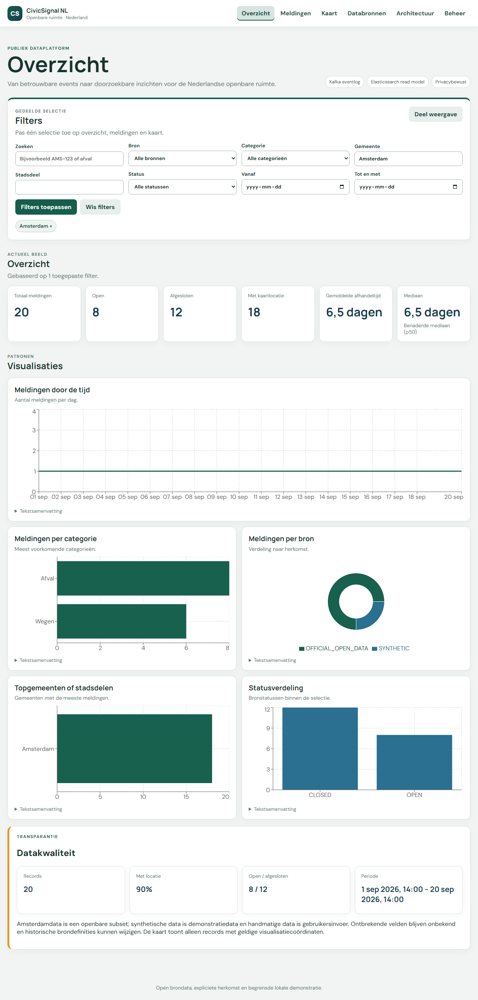
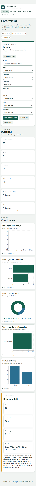

# CivicSignal NL

CivicSignal NL is an event-driven platform for reports in Dutch public spaces.

## Current phase

The complete application runs in Docker Compose behind one Nginx origin, with readiness probes, request correlation, metrics and automated CI. Start with [the local production stack](docs/local-production-stack.md), [observability](docs/observability.md) and [CI](docs/ci.md). The [frontend guide](docs/frontend.md) and [geospatial contract](docs/geospatial-analytics.md) describe the dashboard.





Admin credentials are kept only in browser memory; refreshing deliberately logs the administrator out.

## Technologies

- Java 21 and Spring Boot
- Apache Kafka
- Elasticsearch
- React and TypeScript

## Run the backend

From `backend/`:

```powershell
.\\mvnw.cmd spring-boot:run
```

The status endpoint is available at `http://localhost:8080/api/v1/status`.

## Local stack and frontend

```powershell
# Inject POSTGRES_PASSWORD first; see the stack guide below.
docker compose up -d --build --wait
```

Before starting Compose, inject `POSTGRES_PASSWORD` in the environment. Use `docker compose up -d --build --wait` to build and start all services and `docker compose stop` to stop without deleting volumes. Optional admin credentials are injected at runtime; empty credentials disable administration. See [credential setup and commands](docs/local-production-stack.md).

The containerized dashboard and API share `http://localhost:8081`. Infrastructure ports stay internal. For host development, start infrastructure with `compose.dev.yaml`, then run Spring Boot at `8080` and Vite at `5173`. Set `VITE_API_BASE_URL` for a custom development backend and `CIVIC_SIGNAL_CORS_ALLOWED_ORIGINS` for a custom development origin.

The public dashboard has overview, reports, map, sources and architecture routes. The isolated admin route exposes generator, Amsterdam sync and dead-letter controls only after login.

## Run tests

From `backend/`:

```powershell
.\\mvnw.cmd test
```

The full isolated Compose smoke is `node scripts/compose-smoke.mjs` (Node 24.15.0). It generates temporary credentials, checks the application end to end, and stops its containers with all fixture data in disposable storage. It does not delete existing volumes.
