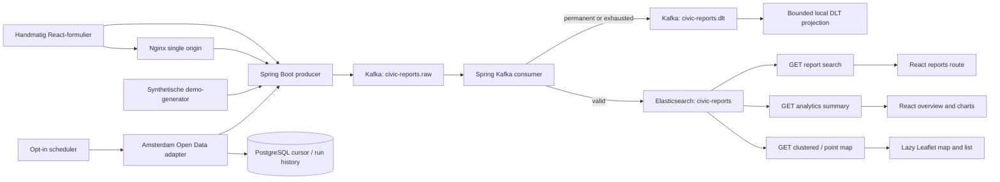

# Architecture

Kafka is the durable event log; Elasticsearch is the derived read model used by search, aggregation analytics and geospatial map queries. The three APIs share one typed filter query. Records are acknowledged only after indexing succeeds or the DLT publish succeeds. The DLT projection is intentionally local and in-memory; it supports inspection, not replay.

PostgreSQL is not a report database: it only persists Amsterdam source cursors and import-run audit metadata. The adapter moves its cursor after Kafka confirms publication, preserving at-least-once delivery across restarts.

The frontend has one public API client without credentials and a separate in-memory admin client. Browser history and query parameters hold the shared public selection; they do not hold credentials. Analytics, report search and map components own independent loading/error boundaries and cancel stale requests.

## Runtime boundary

Compose exposes only loopback Nginx (`8081`). Nginx serves the React build, falls back to `index.html` for browser routes, and forwards `/api/` and `/actuator/` to the internal Java 21 backend. Kafka topic initialization completes before backend startup; PostgreSQL and Elasticsearch must be healthy. The frontend waits for backend readiness, which includes the database, both Kafka topics and the geo mapping. Liveness tests only application availability.

Validated `X-Request-ID` values connect HTTP response headers, MDC logs, Kafka producer headers, consumer indexing and DLT recovery. Spring/Micrometer supplies HTTP and Kafka timers; bounded operation/outcome tags measure Elasticsearch and Amsterdam operations. Graceful shutdown drains HTTP requests, stops Kafka consumers and waits for scheduled work. Record acknowledgement and the composite cursor continue to follow successful downstream publication/indexing.

The GitHub Actions workflow independently validates Java tests, frontend checks and both application images. The local smoke uses its own Compose project and tmpfs data; normal named volumes remain intact.
