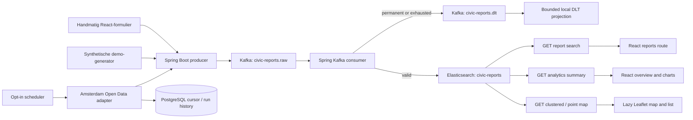

# Architecture

Kafka is the durable event log; Elasticsearch is the derived read model used by search, aggregation analytics and geospatial map queries. The three APIs share one typed filter query. Records are acknowledged only after indexing succeeds or the DLT publish succeeds. The DLT projection is intentionally local and in-memory; it supports inspection, not replay.

PostgreSQL is not a report database: it only persists Amsterdam source cursors and import-run audit metadata. The adapter moves its cursor after Kafka confirms publication, preserving at-least-once delivery across restarts.

The frontend has one public API client without credentials and a separate in-memory admin client. Browser history and query parameters hold the shared public selection; they do not hold credentials. Analytics, report search and map components own independent loading/error boundaries and cancel stale requests.
