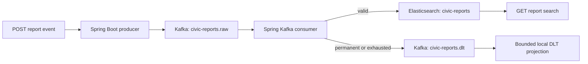

# Architecture

Kafka is the durable event log; Elasticsearch is the derived search index used by the Search API. Records are acknowledged only after indexing succeeds or the DLT publish succeeds. The DLT projection is intentionally local and in-memory; it supports inspection, not replay.
