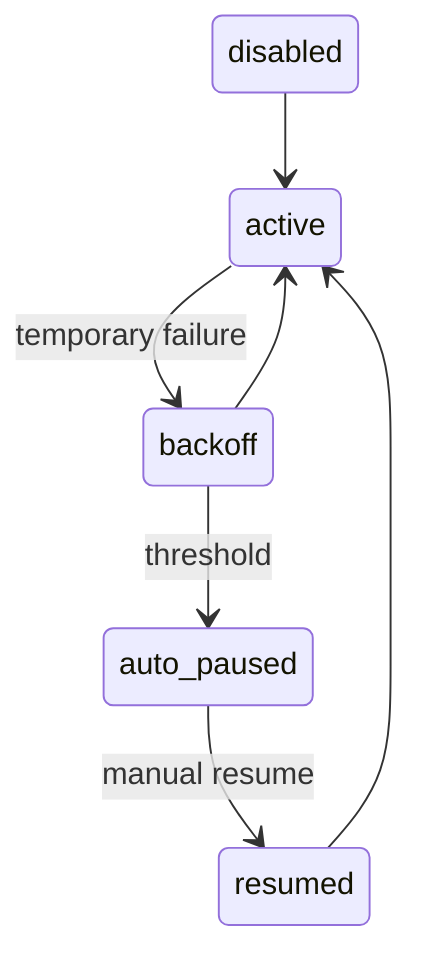

# Geplande Amsterdam-sync

De scheduler staat standaard uit. Activeer met `CIVICSIGNAL_AMSTERDAM_SCHEDULER_ENABLED=true`; `fixedDelay` is de wachttijd ná een run, geen cronexpressie. De defaults zijn 15 minuten delay, 30 seconden initial delay, 100 records en 30 minuten back-off. Configureer met `CIVICSIGNAL_AMSTERDAM_SCHEDULER_FIXED_DELAY`, `_INITIAL_DELAY`, `_IMPORT_LIMIT`, `_FAILURE_BACKOFF`, `_MAX_FAILURES` en `_AUTO_PAUSE`.

De bestaande PostgreSQL advisory lock voorkomt overlap. Een bezette lock is een veilige skip. Tijdelijke fouten verhogen de teller en gebruiken back-off; bij de drempel pauzeert de scheduler automatisch. Pause/resume is runtime-only en verdwijnt na een herstart. Health doet geen live Amsterdam-call.



```powershell
Invoke-RestMethod http://localhost:8080/api/v1/admin/sources/amsterdam/scheduler
Invoke-RestMethod http://localhost:8080/api/v1/admin/sources/amsterdam/scheduler/pause -Method Post
Invoke-RestMethod http://localhost:8080/api/v1/admin/sources/amsterdam/scheduler/resume -Method Post
Invoke-RestMethod http://localhost:8080/api/v1/admin/sources/amsterdam/scheduler/run-now -Method Post
```

Metrics: `civic_amsterdam_sync_scheduled_total`, `_success_total`, `_partial_total`, `_failed_total`, `_skipped_locked_total`, `_auto_paused_total`, `_manual_run_total` en de gauge `_consecutive_failures`.

De lokale frontend toont status, runtime-pauze, runhistorie en handmatige acties. Environmentconfiguratie verandert nooit vanuit React en er is geen polling; na een actie wordt de status eenmaal vernieuwd. Beheerendpoints moeten vóór publieke inzet worden beveiligd.
