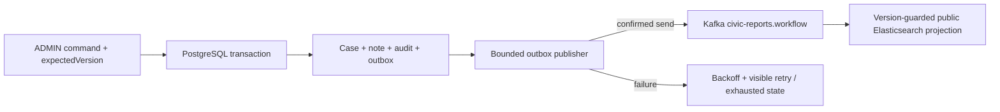

# Transactional outbox

Flyway V2 creates `report_case`, `report_note`, `report_audit` and `report_outbox`. A status/note command runs in one PostgreSQL transaction: optimistic case update, immutable audit insert, optional note insert, and outbox insert. Failure rolls everything back. `event_id`, `note_id` and per-aggregate versions have uniqueness constraints; notes and outbox reference existing audit events. Queries have report/version and pending-publication indexes.

Each publisher claims one due row with `FOR UPDATE SKIP LOCKED`, retaining that lock through the bounded Kafka confirmation wait. Another worker cannot claim it. Earlier unpublished versions block later events for that aggregate, while other aggregates remain eligible. Each pass processes at most 10 rows by default (valid range 1–50). Per-row transactions avoid holding an entire batch open.

The publisher marks `published_at` only after Kafka acknowledgement. A crash between Kafka success and database commit may publish the same event again: delivery is **at least once**, not exactly once. Producer idempotence reduces broker-level duplicates; aggregate version guards make consumer replay a no-op. A newer immutable snapshot includes earlier transition dates and counters, so an older status/note event cannot regress state. Discovery updates also preserve workflow fields/status and ignore older discovery timestamps. Notes are never copied into the public projection. Consumer handling does not insert command-model audit or notes, preventing duplicate deliveries from creating duplicate history.

## Configuration and recovery

| Property / environment | Default |
| --- | --- |
| `CIVICSIGNAL_OUTBOX_ENABLED` | true in local/Compose |
| `CIVICSIGNAL_OUTBOX_FIXED_DELAY` | 5000 ms |
| `CIVICSIGNAL_OUTBOX_BATCH_SIZE` | 10 |
| `CIVICSIGNAL_OUTBOX_MAX_ATTEMPTS` | 5 |

The publisher waits up to five seconds for each send acknowledgement (producer metadata/delivery bounds remain applicable). Failures increment attempts and schedule 5, 10, 20… seconds of backoff, capped at 300 seconds. Exhausted records stay visible and block subsequent versions for that report. `run-now` respects the same due-time, limits and locking; it cannot rewrite/replay exhausted payloads. Investigate exhausted records and plan explicit operator remediation; this phase deliberately adds no unlimited replay button. Stop/start does not erase failed rows.

Only generic `PUBLICATION_UNAVAILABLE` is retained in `last_error`; no exception body, note, reason or credentials. Metrics and the secured outbox status expose pending/retrying/failed counts, oldest pending time and latest confirmed publication. A broker outage does not roll back an already committed HTTP command: outbox rows survive until recovery. Database outages return 503 to commands. An exhausted Kafka consumer recovery stops listeners and latches readiness DOWN under the existing safety policy; repair dependencies before restarting backend.

## Verification

`backend/mvnw test` includes PostgreSQL Testcontainers tests for atomic rollback, uniqueness, concurrent optimistic locking, parallel outbox claims, successful sends and failure/backoff/recovery. Docker must be available; Testcontainers 1.21.4 supports the current Docker Engine API. No developer database is used.

Run `node scripts/compose-smoke.mjs --workflow` for the complete bounded integration check, or add `--skip-build` after validated images exist. It uses the existing isolated smoke project with disposable storage and generated credentials, temporarily disables automatic outbox publication, pauses only its own Kafka service for one failure, then resumes and manually drains due events. It verifies four status transitions plus one note, five audit/outbox rows, projected status/timestamps, exact analytics, public-data privacy, duplicate/out-of-order delivery, Kafka correlation, DLT, Flyway and health. Controlled PostgreSQL/Elasticsearch rows are deleted and the smoke's containers are stopped/removed; existing named volumes are never deleted.

Targeted browser checks: `cd frontend` and `npx playwright test e2e/report-workflow.spec.ts --workers=2`. These use controlled HTTP fixtures on desktop/mobile; real infrastructure behaviour is covered separately by the Compose smoke. Screenshots and results remain ignored build artifacts.
